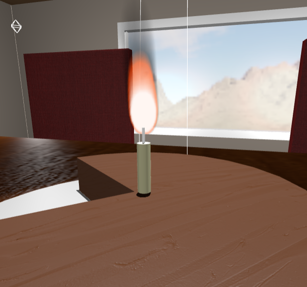
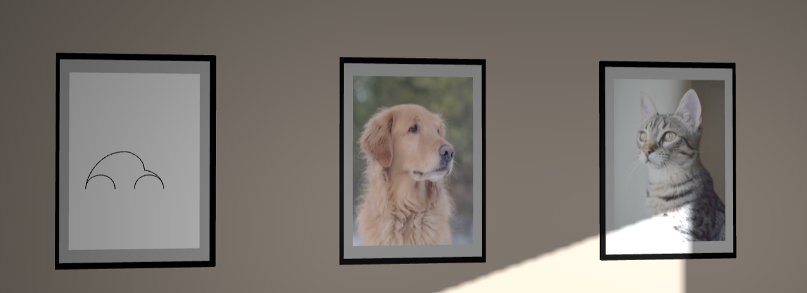
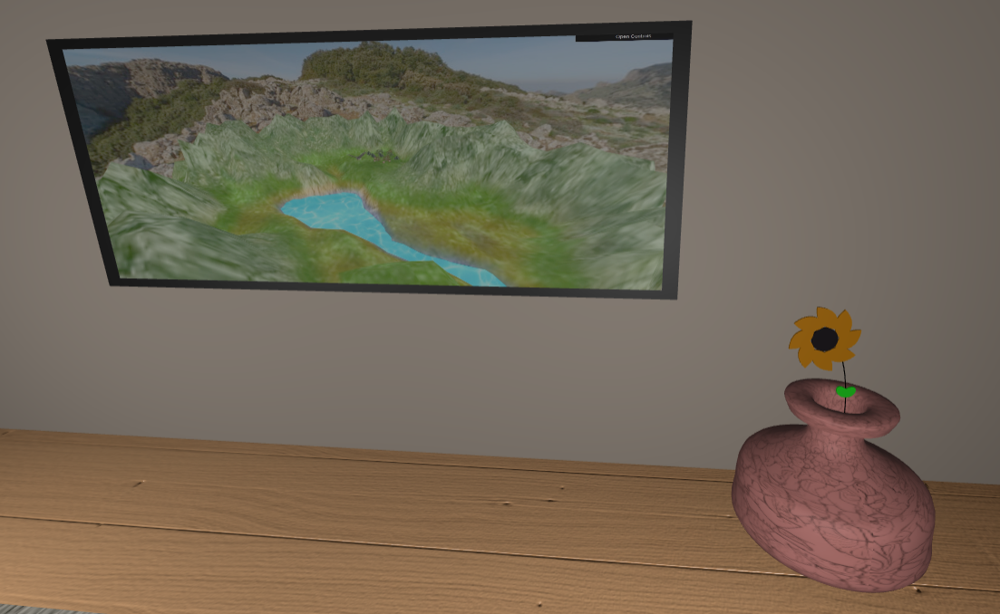
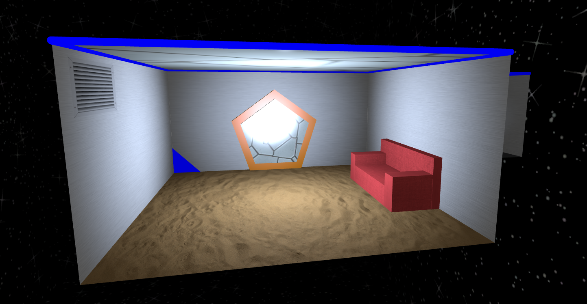

# SGI 2023/2024

## Group T04G08

| Name          | Number    | E-Mail                     |
| ------------- | --------- | -------------------------- |
| Marco André   | 202004891 | <up202004891@edu.fe.up.pt> |
| Ricardo Matos | 202007962 | <up202007962@edu.fe.up.pt> |

---

## Projects

### [TP1](tp1/README.md)

#### Project information

- **Exploration of different types of textures**. Namely, simple textures, video textures and normal maps.
- **Exploration of different types of materials**. For instance, metalic materials for the chair and table support, a wood material for the table top, ceil and floor, a red cloath material for the chair, a clay material for the jar and a glass translucide material for the window.
- **Exploration of different types of lights and shadows**. Namely, spotlights, point lights and directional lights. With lights entering the room from the windows, giving more realism for the scen and shadows being casted in the scene.
- **Exploration of different types of cameras**. Namely, perspective cameras, first person camera and orthographic cameras for frontal and back view
- **Exploration of lines**. Namely, the use of lines to draw a frame of a car, a folded newspaper, a spring and a vase with a flower in it.

#### Scene description

- A scene with a wooden table and 4 red chairs, a carpet, a clay jar with a sunflower, a workign television and 3 frames (of a dog, cat and a car drawn with lines). On the table is a cake on a plate, a jornal with multiple pages and a spring. There are 4 lights on the corners of the room and one spotlight on top of the cake. Sunlight is streaming into the room through the window.
- Its possible to see the outside of the window moving around, following the camera. A skybox is used to give the parallax illusion of a landscape outside the window.

#### Extra features

- The camera has a **first person view** that can be moved around the scene using the keyboard (WASD + Arrows + SHIFT + Space) .
- Use of a **skybox** to give the illusion of a landscape outside the window
- Use of a **video texture** for the television
- Use of a **normal maps** for floor, wood table top and chair
- Optional **shader** for a more realistic fire in the candle

---

### [TP2](tp2/README.md)

#### Implemented Features

- Scene graph hierarchy organization
- Scene graph material, texture, transformation, shadows inheritance
- Node duplication to resolve scene tree issues in ThreeJS
- Utilization of various materials
- Implementation of LOD (Level of Detail) on two objects (a spaceship with three levels and a statue with two levels)
- Implementation of a Space Skybox displaying stars
- Integration of simple textures
- Implementation of Mip-Map Texture with four different resolutions for a holographic table (including a small mark - for easier assessment)
- Application of Bump Map textures on the metal floor, garage door, and sand floor
- Integration of Video texture on a door's code and on the energy orb on the main statue
- Display of a Wireframe object in a holographic globe projection
- Implementation of Buffer Geometry
- Introduction of a GUI for interaction and scene control

#### Scene description

#### Special features

- Nurbs used for statue and spaceship for extra geometry detail
- Fully Implemented YASF (XML) features
- Creative scene

---

### [TP3](tp3/README.md)

TODO
