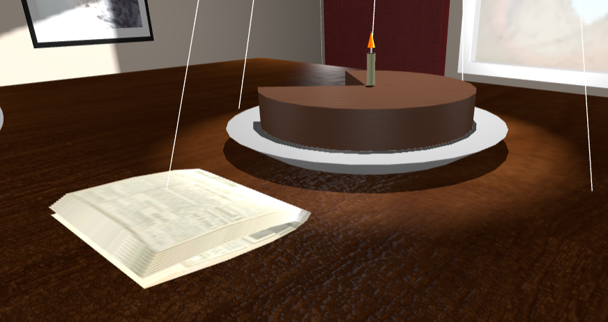
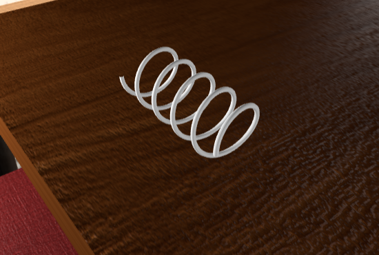

# SGI 2023/2024

## Group T04G08
| Name             | Number    | E-Mail             |
| ---------------- | --------- | ------------------ |
| Marco André         | 202004891 | up202004891@edu.fe.up.pt                |
| Ricardo Matos         | 202007962 | up202007962@edu.fe.up.pt                |

----

## Projects

### [TP1 - ThreeJS Basics](tp1)

- Exploration of different types of textures. Namely, video Textures and normal maps.
- Exploration of different types of materials. For instance, metalic materials for the chair and table legs, a wood material for the table top, ceil and floor, a red courino material for the chair, a clay material for the jar and a glass material for the window.
- Exploration of different types of lights and shadows. Namely, spotlights, point lights and directional lights. With lights entering the room from the windows, giving more realism for the scene.
- Exploration of different types of cameras. Namely, perspective cameras, in person cameras and orthographic cameras.
- Scene
  - A scene with a table and 4 chairs, a carpet, a jar with a sunflower, a television and 3 frames (of a dog, cat and a car, "carocha"). On the table is a cake on a plate, a jornal with multiple pages and a spring. There are 4 lights on the corners of the room and one spotlight on top of the cake. Sunlight is streaming into the room through the window.
  - Its possible to see the outside of the window moving around, following the camera. A skybox is used to give the illusion of a landscape outside the window.

-----

### [TP2 - ...](tp2)
- (items briefly describing main strong points)

----

### [TP3 - ...](tp3)
- (items briefly describing main strong points)

