# SGI 2023/2024 - TP3

## Group T04G08

| Name          | Number    | E-Mail                     |
| ------------- | --------- | -------------------------- |
| Marco André   | 202004891 | <up202004891@edu.fe.up.pt> |
| Ricardo Matos | 202007962 | <up202007962@edu.fe.up.pt> |

---

### Game Instructions

The game starts with a menu screen, where the user can choose to start the game, see some basic instructions or exit the game.
The user selects a name, a track, then difficulty and, if it is not in easy mode, a menu appears to drop obstacules on the track. Finally, when all demanded obstacules are placed, a garage opens up so the player can choose the car to play as.
The game then starts and the player can control the car with the AWSD keys (and also pause with ESC). The rival car is invincible and is not affected by any collisions or modifiers from powerups/obstacles. The player must avoid the obstacles and catch the powerups to win the game to maximize its chance of winning the race of 3 laps. The more powerups catched, the more obstacles appear on the map, so equilibrium is key to winning the game.
In the end, the player is presented with a podium with basic time stats and can choose to play again or exit the game.
The scene has multiple elements to provide liveliness and immersion, like trees, mountains, skybox, water, fireworks, etc.
The game has sound effects, background music and a debug menu with useful options.

### Implemented features

All demanded features were implemented:

- track creation with catmull-rom curves
- car movement (AWSD keys) with tire animations, steering, speed control and friction
- rival car movement (automatic) using soft keyframes animation
- multiple menus with mouse hover and click detection
- Raycasting picker for menu interaction
- car selection (with garage)
- lap count and time stats tracking and update on in-game HUD
- text based on spritesheet for better performance
- pause menu (ESC key)
- collision detection for cars, obstacles and out of track bounds
- powerups (speed boost, invincibility)
- obstacles (slowdown, control inversion)
- box pulsating shader with transparency for powerups and obstacles
- outdoor display with lap count and time stats. Also present in the HUD panel
- creation of a TV screen (with 3D effect for depth) using shaders of first-person camera view
- particle animation of colorful fireworks with explosion effect on the podium for the winner
- particle system using physics for realistic effects

### Extra features

Multiple extra features were implemented:

- multiple tracks in JSON format with a track parser for easy new track addition
- menu for selecting the multiple tracks with a catmull-rom curve to preview the track
- python script to convert png track drawings into track JSON files
- rival car calculates its own path to follow the track for adaptability
- car smoke particles when standing still
- countdown animation and win/lose animation
- water lake shader with reflection, refraction and waves
- sound effects in menus and game
- background game music for immersive experience
- using of pre-made objects for a more detailed/good-looking scene
- Nametag sprites above cars
- immersive scenary with billboard trees, skybox and mountains surrounding the track
- debug flight camera with useful information like position
- debug menu with useful options and toggles
- shader loader for code organization

### Screenshots

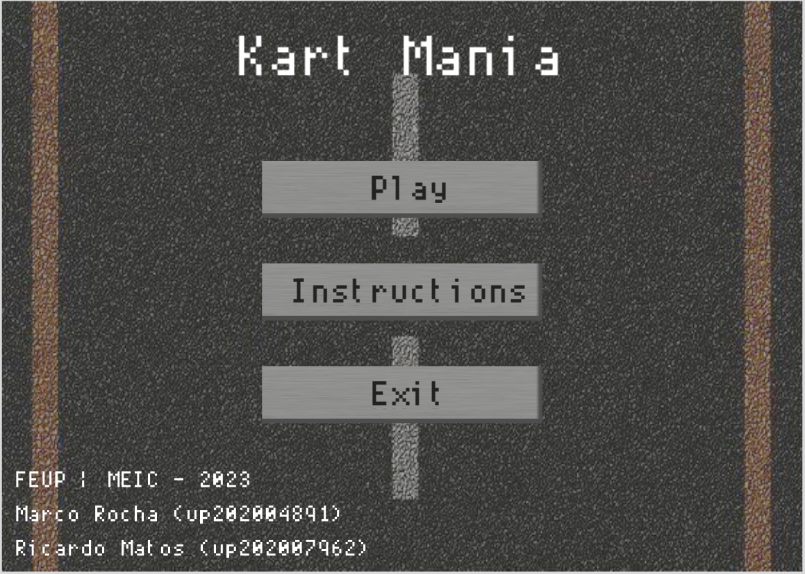
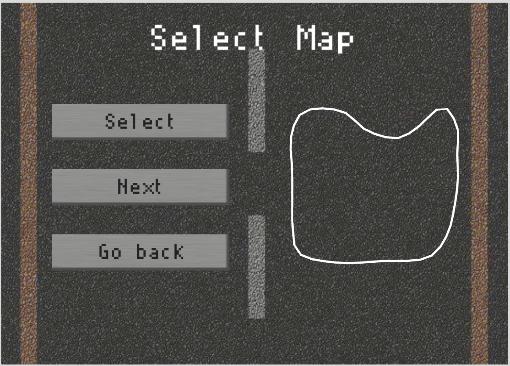

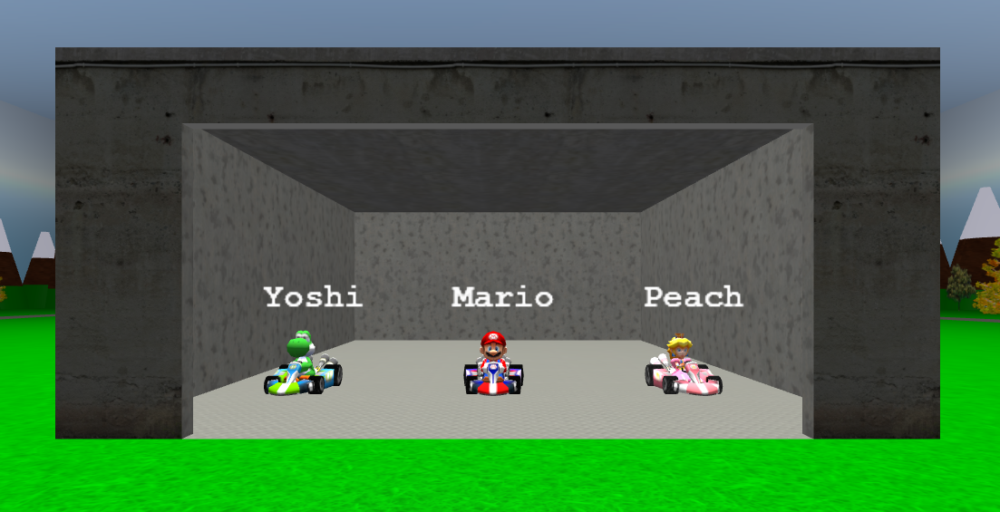
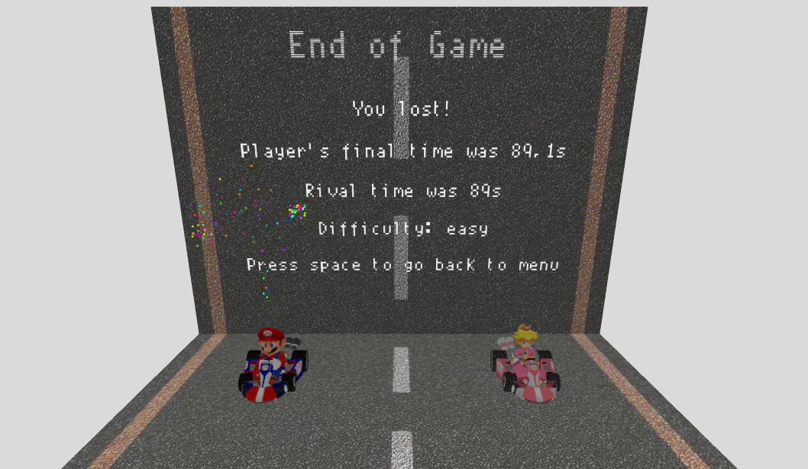
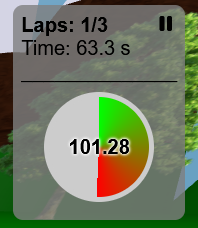
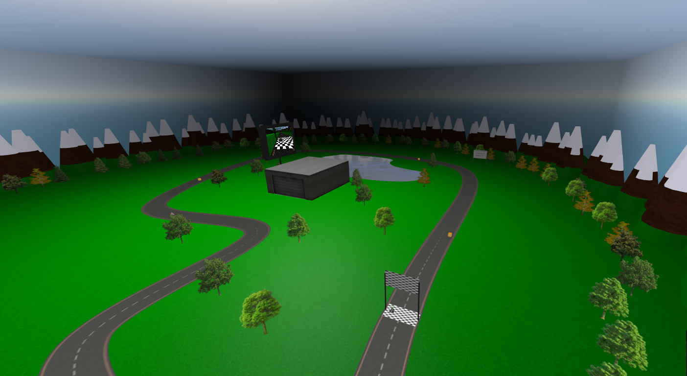
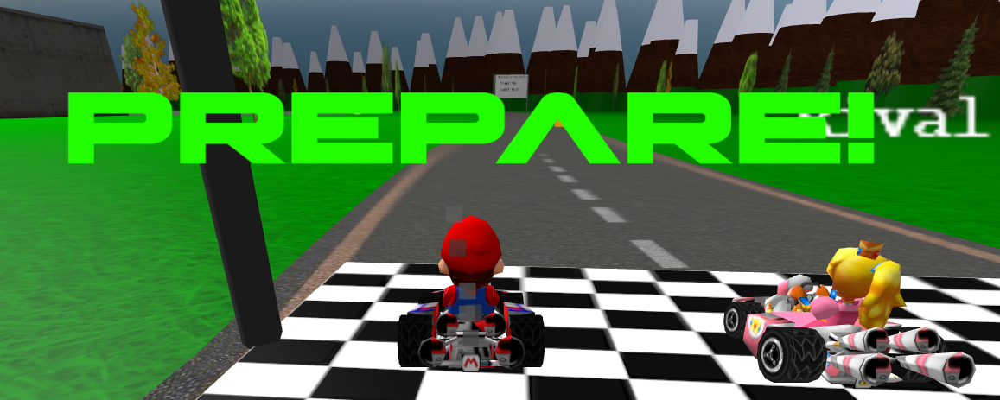
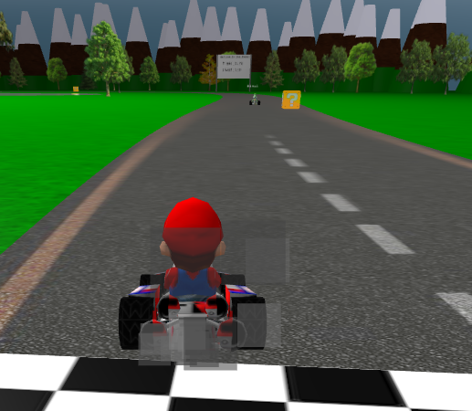
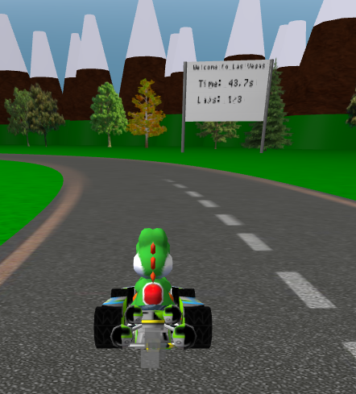
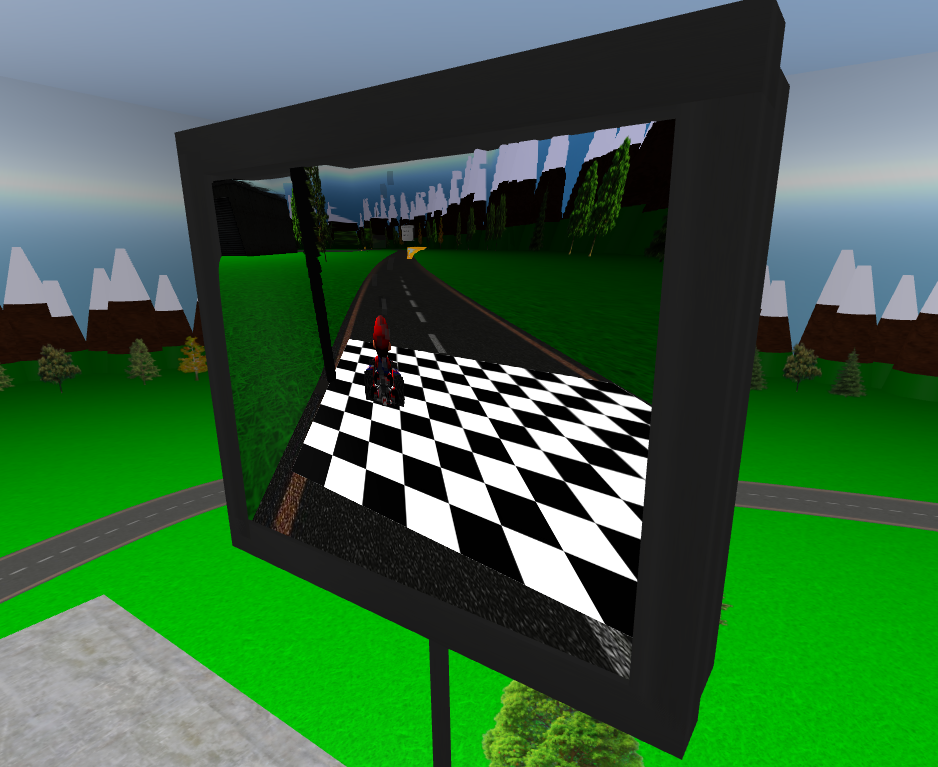
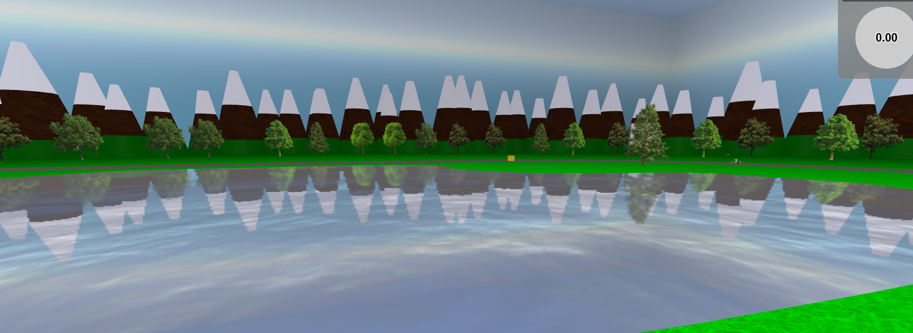
